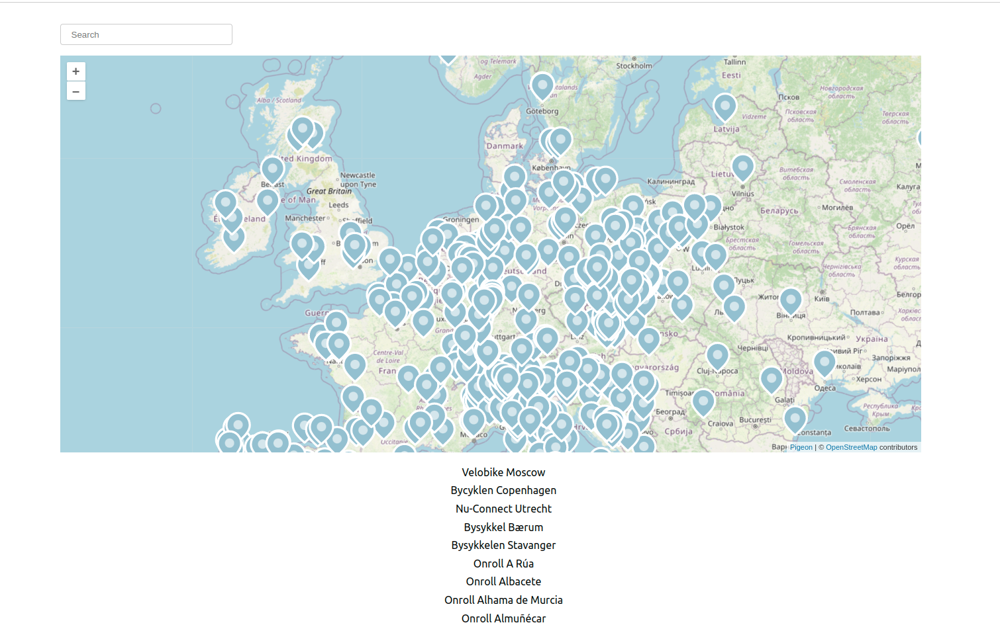

## Public Bikes
You are task with creating a desktop React application, which shows all local bike rental providers globally on a world map. (see Image below)  


### Task 
- Your page should have an input field
- Your page should display a ```Map``` with ```Markers``` for each bike rental provider
- Your map should contain a ```ZoomControl```.
- Your page should list all bike rental providers below the ```Map```.
- While the user tips, your app should update your markers on the map and the bike rental provider list.
- When the user clicks on a ```Marker```, additional information about the provider should be displayed.

### Points to consider
- You will use the [CityBikes API](https://api.citybik.es/v2/) to get all bike rental providers.
- Use `useEffect` to control and change your states every time a user makes a search request.
- You can use [Pigeon Maps](https://pigeon-maps.js.org/docs/) in order to display your map with all your fetched providers
- Research on ```Map, Marker, ZoomControl, Overlay```

## Example




## Bonus
- Use javascript's [Geolocation API](https://developer.mozilla.org/en-US/docs/Web/API/Geolocation_API) to center your map around your current location as default. 